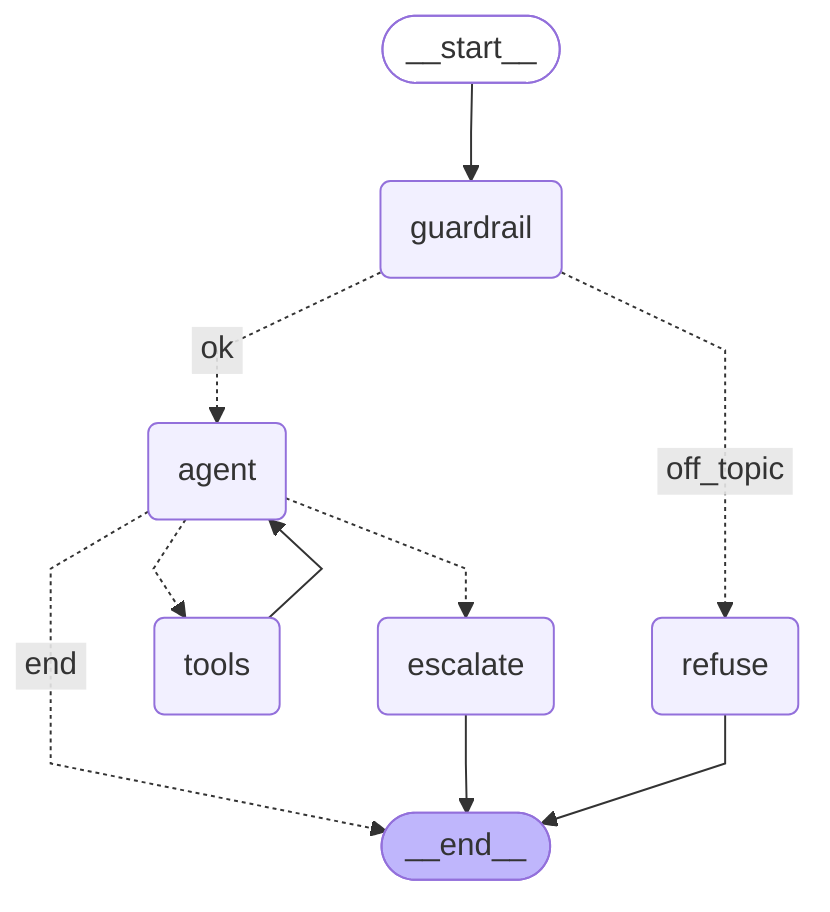

# support-agent

A support agent that answers product questions from a documentation set, built
with LangGraph. It looks things up with tools (docs and past tickets), escalates
cases it shouldn't handle, refuses off-topic questions, and is traced with
Langfuse and measured with an eval harness.

**Stack:** LangGraph · hand-rolled ReAct loop · SQLite memory · Langfuse tracing ·
agent evals · FastAPI · GCP Cloud Run.

> Status: **deployed** — see [Live demo](#live-demo).

## What it does

Ask it a question about a fake SaaS product called Nimbus. A cheap guardrail first
checks the question is about Nimbus and refuses politely if not. Otherwise a
ReAct agent decides what to do: search the official docs, search past support
tickets for precedent, or escalate to a human for billing disputes, security and
data requests. Conversation memory is kept per session. Every run is traced, and
the whole thing is scored by an eval harness (see [Evaluation](#evaluation)).

## Architecture

The agent is a hand-written LangGraph loop in [src/react_agent.py](src/react_agent.py)
(no `create_react_agent`). Diagram generated from the real graph:



- `guardrail` is one cheap LLM call that routes off-topic questions to `refuse`.
- `agent` and `tools` form the loop: the model asks for a tool, the tool node runs
  it and feeds the result back, until the model answers.
- `should_continue` is the loop's brain. After 5 tool rounds (`MAX_TOOL_STEPS`) it routes
  to `escalate` instead of looping forever. A tool that raises becomes an error message the
  model can react to, not a crash.

## Evaluation

30 questions (10 docs, 10 tickets, 5 escalate, 5 off-topic) run through the same graph the API
serves, each on a fresh thread. Run: 2026-10-02. Model: `gpt-4.1-mini` (judge uses the same model).

| Metric | Result |
|---|---|
| Trajectory accuracy (overall) | 27/30 (90%) |
| &nbsp;&nbsp;docs | 10/10 (100%) |
| &nbsp;&nbsp;tickets | 10/10 (100%) |
| &nbsp;&nbsp;escalate | 2/5 (40%) |
| &nbsp;&nbsp;offtopic | 5/5 (100%) |
| Escalation correct | 2/5 |
| Off-topic refusal correct | 5/5 |
| Tool rounds (avg / max) | 0.83 / 1 |
| Answer quality (docs+tickets, n=20) | 18 correct, 2 partial, 0 wrong |
| Avg cost / question (estimated) | $0.00052 |
| Latency p50 / p95 (warm) | 2.8s / 3.6s |

Cost is estimated from token counts at gpt-4.1-mini list prices and includes the guardrail
call but not the judge. Full report: [eval_report.md](eval_report.md).

**Known weakness, reported as measured:** the agent escalated only 2 of 5 cases that need a
human (e1, e3 and e4 were answered from the docs instead). The system prompt was not tuned
to hit a target; see [docs/known_behaviors.md](docs/known_behaviors.md). Also, on the 10
ticket questions the agent mostly reached for `search_docs` rather than `search_tickets`
(both count as acceptable in the harness).

## Example conversations

Real outputs from the eval run.

**A docs answer**

> **Q:** How do I invite team members?
> **A:** To invite team members in Nimbus, go to Settings > Members > Invite. Enter their email address and select a role for them. They will receive an invite link valid for 7 days. You can invite multiple people at once by pasting multiple emails separated by commas. Pending invites only count toward your plan's member limit after they accept. You can also revoke pending invites from the same page.
> *Tools used: `search_docs`*

**A ticket / precedent answer**

> **Q:** The mobile app is showing old data compared to the web.
> **A:** To resolve the issue of the mobile app showing old data compared to the web, please try the following steps: 1. Pull down to refresh the data in the mobile app. 2. Confirm you are in the correct workspace in the app. 3. Go to Settings > Sync > Resync in the mobile app to force a data sync. This should update the mobile app with the latest data from the web. Let me know if the problem persists.
> *Tools used: `search_tickets`*

**An escalation**

> **Q:** I was charged for a teammate who already left and I want it reversed.
> **A:** I have escalated your billing dispute to a human support agent who will assist you with reversing the charge for the teammate who has left. You should hear from them shortly. If you have any other questions in the meantime, feel free to ask!
> *Tools used: `escalate_to_human`*

## Live demo

Live URL: <https://support-agent-947244085653.us-central1.run.app>

Deployed on Cloud Run (`us-central1`, scale-to-zero, max 1 instance, 10 requests/min/IP).
The first request after idle is a slow cold start, and conversation memory is not
durable across restarts. Deploy steps: [docs/DEPLOY.md](docs/DEPLOY.md).

## Run it locally

```bash
python -m venv .venv && source .venv/bin/activate
pip install -r requirements.txt
python scripts/build_kb.py           # generate the knowledge base
python -m src.retrieval              # build the FAISS index (once)
cp .env.example .env                 # then fill in your keys

# ask the agent from the command line (add --thread NAME to keep memory across turns)
python -m src.react_agent "how much does the team plan cost?"

# run the API + chat page, then open http://localhost:8080/
python -m src.api

# run the evaluation (about 30 questions; costs a fraction of a cent)
python -m src.eval
```

---

## Progress

- [x] **Day 0** — repo, deps, fake knowledge base (34 docs), env + config
- [x] **Week 1 Day 1** — first LangGraph graph (state, nodes, edges)
- [x] **Week 1 Day 3–4** — RAG node (FAISS retrieval + grounded answer)
- [x] **Week 1 Day 5** — self-correcting retrieval (conditional edge): the
      agent grades its own retrieval and rewrites the query up to twice
      before answering, instead of always answering after one pass.
- [x] **Week 1 Day 6–7** — Langfuse tracing: every run is traced (per-node
      spans, tokens, latency, cost).
- [x] **Week 2 Part 1** — tools (docs/tickets/escalate) + prebuilt ReAct
      agent + SQLite short-term memory: tool choice and per-thread memory
      are both demonstrated live.
- [x] Week 2 Part 2a — hand-rolled ReAct loop (agent/tools/should_continue,
      step-cap escalation)
- [x] Week 2 Part 2b — guardrails (off-topic refusal gate, tool-error handling)
      Plus input/output length caps and prompt-injection–resistant system prompt
      (data vs. instructions separation).
- [x] Week 2 Part 2c — FastAPI service + minimal chat UI
- [x] Week 3a — evaluation harness + results (`src/eval.py`, `eval_report.md`)
- [x] Week 3b — Cloud Run deploy (Dockerfile, runbook, live service)
- [x] Week 3c — README (overview, architecture diagram, eval table, examples)
